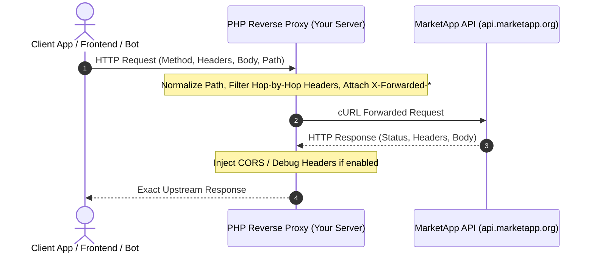

# Introduction

## What is MarketApp API Reverse Proxy?

**MarketApp API Reverse Proxy** is an intermediary PHP script that intercepts client HTTP requests, forwards them to the official **MarketApp API** (`https://api.marketapp.org/`), and mirrors the upstream response back to the client.

---

## Why Use This Proxy?

1. **Bypass Network & Regional Restrictions:** Run the proxy on an intermediate server located close to your infrastructure or outside restricted network zones.
2. **Centralized Authorization & Custom Headers:** Inject partner credentials, API tokens, or custom metrics transparently without modifying client apps.
3. **CORS Enabling for Frontend Apps:** Call MarketApp API directly from web browsers without experiencing Cross-Origin Resource Sharing blocking.
4. **Shared Hosting Ready:** Works out-of-the-box on cPanel, DirectAdmin, Plesk, Nginx, or Apache with zero setup friction.
5. **High Compatibility:** Full compatibility with PHP 7.4, 8.0, 8.1, 8.2, 8.3, 8.4, and 8.5.
